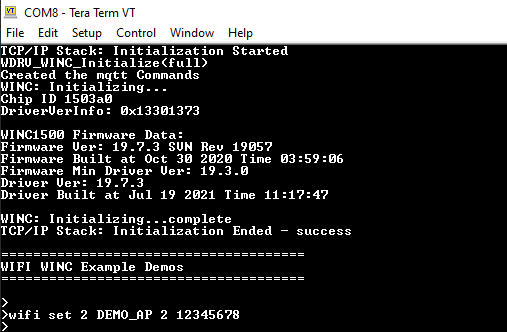
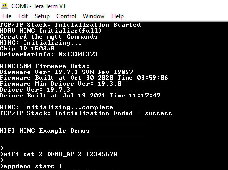
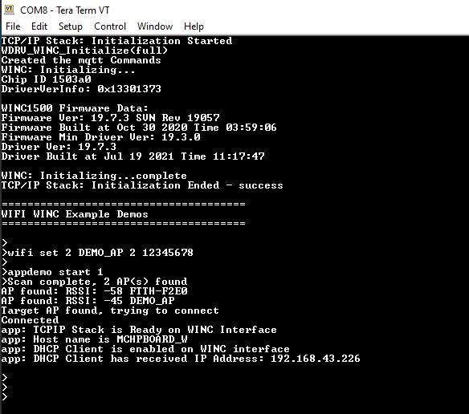
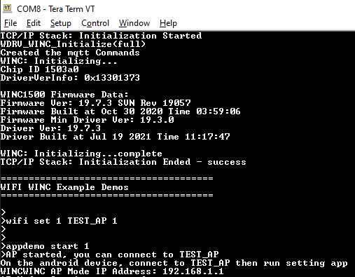
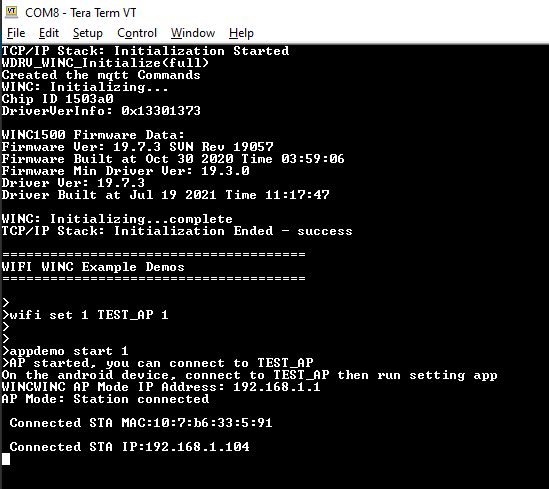

# WiFi Station Mode / Access Point Mode Demo

This example demonstrates the use of the WINC1500 to behave as a Station or Access Point\(AP\).

**Parent topic:**[WINC1500 Bypass Mode Demo Applications](GUID-40C3ABB9-0449-4A53-94DF-0DFB4CE5540E.md)

## Station Mode

1.  Configure the WiFi parameters using the "wifi set " command.

    

2.  Select and run the application using the command "appdemo start 1"

    

3.  The application starts and perform scanning and connects to the WiFi.

    

## Access Point Mode

1.  If the user wants to configure the device as Access Point, configure the wifi using "wifi set" command. In the configuration set the bootmode as Access point mode, keep the authentication type as "OPEN" and give an SSID name for the Access point.

    

2.  Enter the command "appdemo start 1" to run the application.

    

3.  Connect a device to this Access point. The IP address of connected device will be displayed on the console.

    

