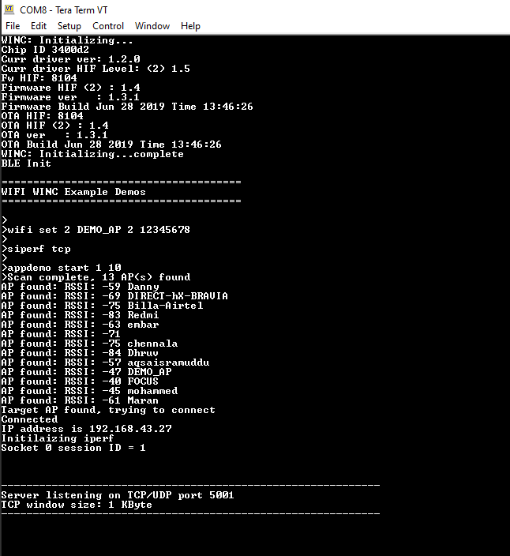

## Iperf Demo

This application demonstrates how a user can run iperf application on WINC1500 device.The steps to be followed to run the demo in socket mode and bypass mode are different. Refer the respective sections for details.

1. Configure the wifi parameters using "wifi set" command.

	

2. Enter the command "appdemo start 1" to set the DUT(Device Under Test) in station mode. It will connect to the wifi network and the IP address will be displayed on the terminal.

	Now follow the below mentioned steps for [Bypass Mode](#bypass-mode-iperf-demo)  and [Socket Mode](#socket-mode-iperf-demo)

### Socket Mode iperf Demo

* Enter "**siperf <tcp/udp>**" on the terminal window to select and start the iperf application demo in the DUT.

	| Command  on DUT       | Details        |                               
	| ----------------| -----------------------------------------------------  
	| siperf tcp    | Starts the TCP server at the DUT| 
	| siperf udp  | Starts the UDP server at the DUT | 
	|||

	

* Enter the application command "appdemo start 1 10 " to run the iperf demo. First the device will connect to the network. The IP address will be displayed on the terminal window. Then the TCP/UDP server will get started.

	

* After the "TCP/UDP" server has started, the user wants to run the iperf commands on the PC to start the iperf application as TCP/UDP Client .

	iperf command details.

	| Command  on PC      | Details        |               Example                |
	| ----------------| ---------------|-------------------------------       |
	| iperf -c <Server_IP_Address> -t <time_peroid> -i <time_interval> -r   | Setup the **TCP Client** in the PC | iperf -c 192.168.43.27 -i 1 -t 10 -r        |
	| iperf -u -c <Server_IP_Address> -t <time_peroid> -i <time_interval> -u -b <bandwidth>  -r  | Setup the **UDP Client** in the PC | iperf -u -c 192.168.43.27 -b 20M -i 1 -t 10 -r |
	|||

* After receiving the "Server Report" on the terminal, enter the iperf commands on the PC to set the iperf application as TCP/UDP server.

	| Command on PC        | Details        |               Example                |
	| ----------------| ---------------|-------------------------------       |
	| iperf -s -i <time_interval>   | Setup the **TCP Server** in the PC | iperf -s -i 1        |
	| iperf -s -u -i <time_interval>  | Setup the **UDP Server** in the PC | iperf -s -u -i 1 |
	|||

### Bypass Mode iperf Demo

* The user should enter the iperf commands in the terminal window (for DUT) and in the iperf application which is available in the PC.

	| Protocol         | PC         | DUT         | Command on PC        | Command on DUT      | 
	| ---------------- | ----------------| ----------------| ---------------|-------------------------------       |
	| UDP   | Client | Server        |iperf -u -c <Server_IP_Address> -t <time_peroid> -i <time_interval> -u -b <bandwidth>  e.g.: iperf -u -c 192.168.43.27 -b 20M -i 1 -t 10 |iperf -s -u -i <time_interval>   e.g.: iperf -s -u -i 1|
	| UDP | Server | Client |iperf -s -u -i <time_interval>   e.g.: iperf -s -u -i 1| iperf -u -c <Server_IP_Address> -t <time_peroid> -i <time_interval> -u -b <bandwidth>  e.g.: iperf -u -c 192.168.43.87 -b 20M -i 1 -t 10 |
	| TCP  | Client | Server | iperf -c <Server_IP_Address> -t <time_peroid> -i <time_interval>   e.g: iperf -c 192.168.43.27 -i 1 -t 10 | iperf -s -i <time_interval>   e.g: iperf -s -i 1|
	| TCP| Server| Client| iperf -s -i <time_interval>   e.g: iperf -s -i 1| iperf -c <Server_IP_Address> -t <time_peroid> -x <bandwidth>   e.g: iperf -c 192.168.43.87 -x 10M -t 10 
	|||

