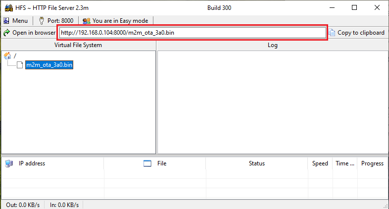

## OTA Demo
This example demonstrates how to upgrade the WINC1500 firmware via OTA. It downloads the WINC1500 firmware from an OTA download server, which is a web server. 

1. Use any HTTP server or hfs.exe from http://www.rejetto.com/hfs/

2. Run the hfs.exe

3. Set the port number to 8000 in the hfs tool.

	

4. Add the OTA firmware from the “\utilities\m2m_ota_3a0.bin” to the root folder in the hfs.exe tool.

		

5. Copy the URL from hfs tool and replace the APP_OTA_URL of app_ota.c file.

	

6. Program the MCU after compiling these changes.

7. Configure the wifi parameters using "wifi set" command.

	

8. Enter the command "ota <image_url>". 

	

9. Enter the application command "appdemo start 1 7" to run the OTA demo. First the device will connect to the network. After the IP address has displayed on the terminal window, application will execute the OTA command and starts the OTA firmware upgrade.

	

