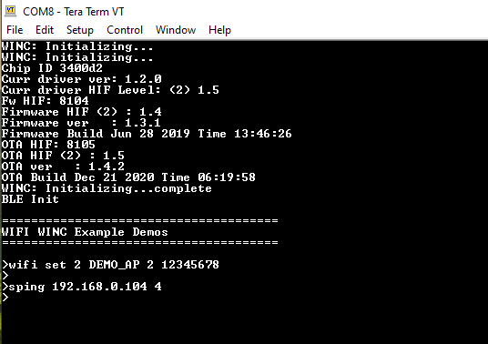
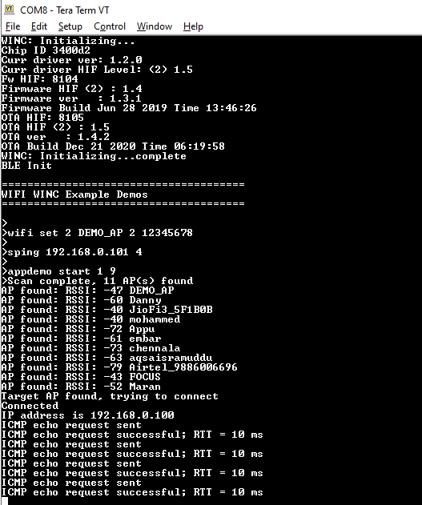
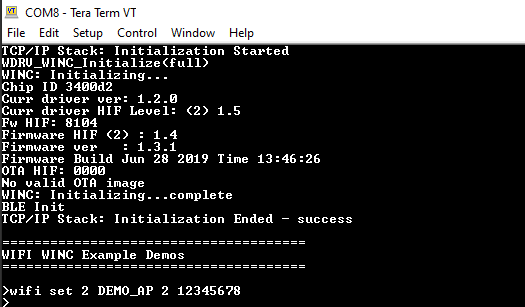
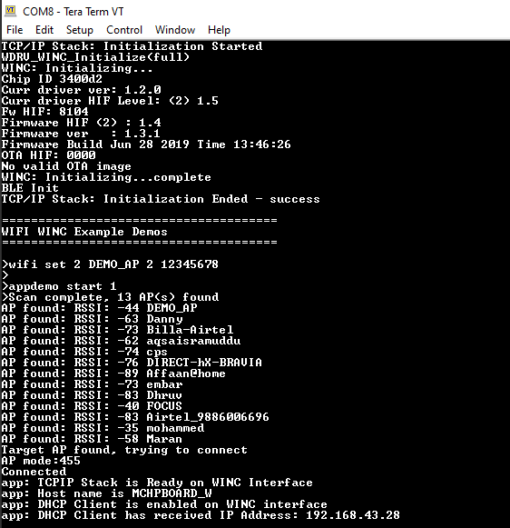
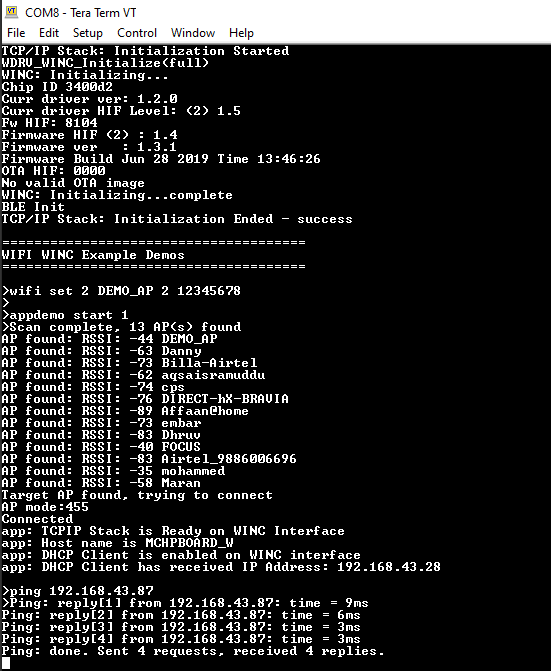

## Ping Demo
This application demonstrates how a user can run a ping test on WINC1500 device. The steps to be followed to run the demo in socket mode and bypass mode are different. Refer the respective sections for details.

### Socket Mode Ping Demo

1. Configure the wifi parameters using "wifi set" command.

	

2. Enter the command "sping <ip_address> <no_of_ping>". 

	

3. Then enter the command "appdemo start 1 9" to run the Ping demo.
First the device will connect to the network. After the IP address has displayed on the terminal window, the ping command will start.

	

### Bypass Mode Ping Demo

1. Configure the wifi parameters using "wifi set" command.

	

2. Enter the Then enter the command "appdemo start 1". Then the device will connected to the AP and the IP address will be displayed on the terminal.

	

3. Enter the command "ping <ip_address>". It will start pinging the corresponding IP address.
	
	

