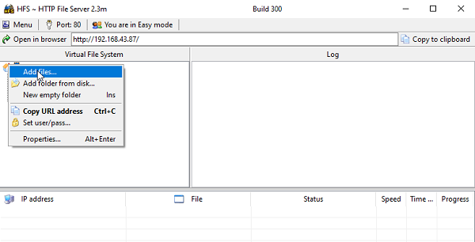
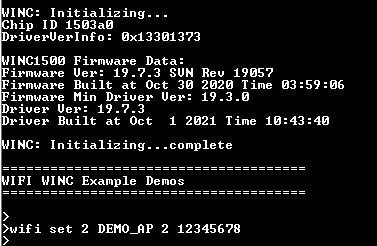
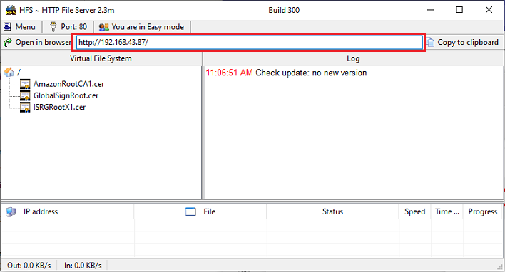
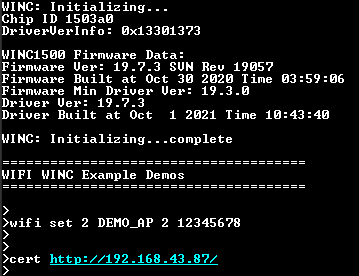
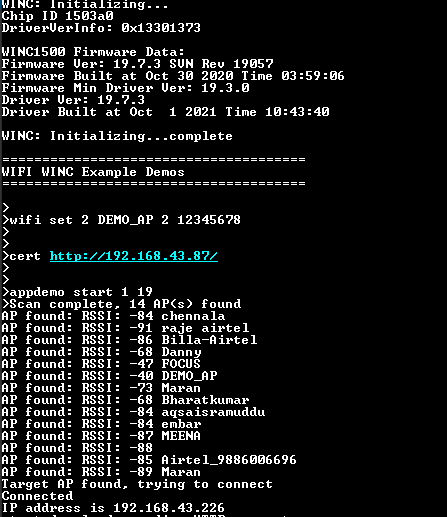
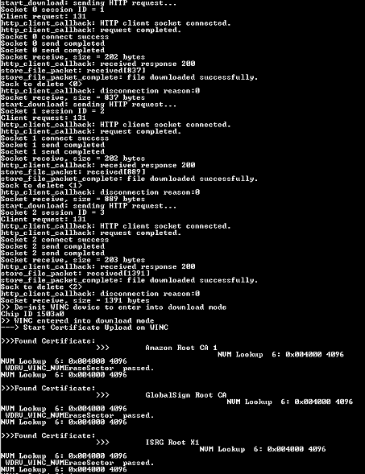
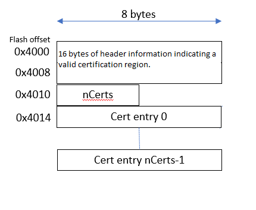

# Certificate Download OTA Demo

This example demonstrates how to download the Root/TLS certificates into WINC1500 via OTA. It downloads the certificates from an OTA download server, which is a web server.

**Note:**
This example will be only available with SAME54 Host

1. Use any HTTP server or hfs.exe from <http://www.rejetto.com/hfs/>

2. Run the hfs.exe

3. Add the certificates from “\utilities\cert_store” to the root folder in the hfs.exe tool.

    

4. Configure the wifi parameters using "wifi set" command.

    

5. Copy the URL from hfs tool.

    

6. Enter the command "cert \<url\>".

    

7. Enter the application command "appdemo start 1 19" to run the Certificate download via OTA demo. First the device will connect to the network.

    

8. After the IP address has displayed on the terminal window, application will execute the CERT command and starts the certificate download.

    

## Download Root Certificates as Single Image (as a bundle)

The existing application can download the Root certificates in der or pem format. If the user wants to convert the certificates into custom WINC format and download it as single image (as a bundle), follow the below mentioned steps.

1. Enable the macro "ROOT_CERT_BUNDLE" in "app_cert_download_ota.h"
2. The root certificate format to be used with winc flash is a winc custom format. User can use the "wireless_wifi\utilities\wifi\winc\tools\image_tool.exe" to convert the root certificate to required format.  User can use the method mentioned in step 3 to convert the certificate into custom WINC format and rename the file as "root_certs.bin"
3. Create a single config file to create only the root certificate region as mentioned below.

            [flash]

            size is 1M

            default is 0

            region at 0x004000 is [root certificates]

            [root certificates]

            type is root certificates

            schema is 1

            size is 4K

            default is 0xff

            file is ../root_certs/AmazonRootCA1.cer

            file is ../root_certs/BaltimoreCyberTrustRoot.cer

            file is ../root_certs/DigiCert.cer

            file is ../root_certs/DigiCertSHA2.cer

            file is ../root_certs/EnTrust.cer

            file is ../root_certs/GlobalSignRoot.cer

            file is ../root_certs/ISRGRootX1.cer

            file is ../root_certs/QuoVadis_Root.cer

            file is ../root_certs/VeriSign.cer

Then run the below mentioned command,  
wireless_wifi\utilities\wifi\winc\files\winc1500>..\..\tools\image_tool.exe -c 19.7.7\root_certs.config -o root_certs.bin -of raw  

This will create a 1MB binary flash image with the root certificates located at 0x4000 to 0x5000. Then that part  of the file  can be extracted to have the new root certificate area.

After creating the image, place this "root_cert.bin" file in the HTTP server and follow the steps 4 to 8 to run the application.

## Root Certificate Format in WINC1500

Given below is an example of a WINC1500 root certificate store with two certificates (out of a total of 9).

