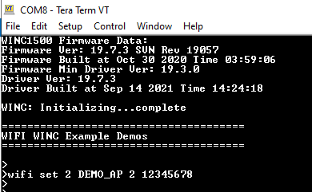

# SSL Demo

This application demonstrates how a user can run a secured TCP Client on WINC1500 device. In this application, we open a secured html page 'https://www.google.com'. Here the TCP SSL Client running on the WINC1500 device shall connect to server google.com over a secured html port 443, and make a reuqtest for getting the html page.

1.  Configure the wifi parameters using "wifi set" command.

    

2.  Enter the command "ssl https://www.google.com/"

    

3.  Enter the command "appdemo start 1 8". The device will connect to the network and IP address will be displayed on the terminal window. After connecting to the AP, the TCP SSL Client on the WINC1500 device shall connect to the Server - google.com over the secured html port 443.

    

    Note: The user needs to ensure that the server certificate is a part of the WINC FW Image in case a secured connection is needed with the server.

4.  After connecting to google Server, the TCP SSL Client on the WINC1500 device shall send a GET HTML request, and the google server shall send in the html page.

    

**Parent topic:**[WINC1500 Socket Mode Demo Applications](GUID-52D24502-1FE3-473D-9DA1-624A4E26166B.md)

