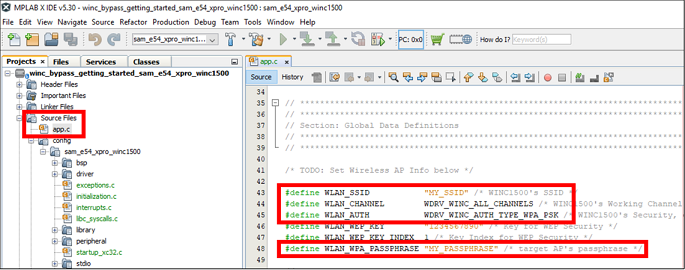
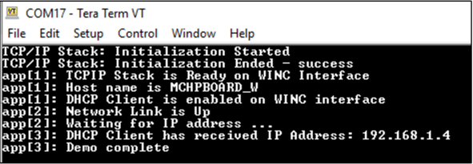

# WINC STA Bypass

This example compiles the WINC STA Bypass application.

**Parent topic:**[Harmony 3 Wireless application examples for WINC1500](GUID-D41DC58E-4197-40C3-B2E5-298EE2491305.md)

## Description

This example implements a simple STA Client application on the SAM E54 Xplained Pro board with the ATWINC1500/3400 XPRO board where the WINC controller is in Bypass/Ethernet mode.

## Downloading and building the application

To download or clone this application from Github, go to the [top level of the repository](https://github.com/Microchip-MPLAB-Harmony/wireless_apps_winc1500)

Path of the application within the repository is **apps/wifi\_winc\_sta\_bypass/firmware** .

To build the application, refer to the following table and open the project using its IDE.

|Project Name|Description|
|------------|-----------|
|sam\_e54\_xpro\_winc1500.X|MPLABX project for SAME54 and WINC1500 Xplained pro|
| | |

## Setting up SAME54 Xplained Pro board

-   Connect the ATWINCxx00 Xpro Wi-Fi board to **EXT1** XPRO Header of SAME54 Xplained baord.

-   Connect the Debug USB port on the SAME54 Xplained Pro board to the computer using a micro USB cable

## Running the Application

1.  Open the project in MPLAB® X IDE and open the **app.c** file to change the access point parameters as shown in the picture below.

    

2.  Build and program the generated code into the hardware using its IDE by using on-board EDBG programmer.

3.  Open a terminal application \(eg: TeraTerm\) and configure the baud rate for **115200**.

    

4.  Press the **Reset** button on the SAM E54 Xplained Ultra board.

5.  The following messages will be visible on the terminal window.

    

6.  Type **ping <PC's IP address\>** in the terminal window and press **Enter** to see responses.

    

7.  You can also ping this board from your PC using cmd prompt as shown below.

    

# How to create this project from scratch

Following Wireless Wiki tutorial shows step-by-step process to create this project from scratch

[Create WINC1500 bypass mode demo from scratch](https://github.com/Microchip-MPLAB-Harmony/wireless/wiki/Create-your-first-winc-bypass-application)

