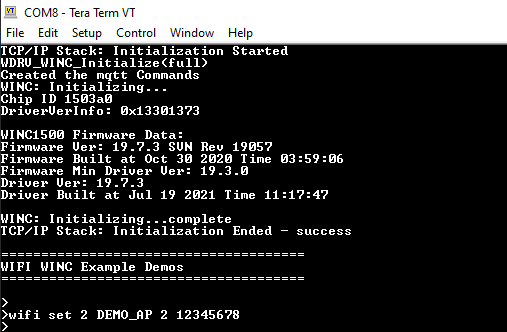

# Ping Demo

This application demonstrates how a user can run a ping test on WINC1500 device in Bypass mode.

1.  Configure the wifi parameters using "wifi set" command.

    

2.  Enter the Then enter the command "appdemo start 1". Then the device will connected to the AP and the IP address will be displayed on the terminal.

    

3.  Enter the command "ping <ip\_address\>". It will start pinging the corresponding IP address.

    

**Parent topic:**[WINC1500 Bypass Mode Demo Applications](GUID-40C3ABB9-0449-4A53-94DF-0DFB4CE5540E.md)

