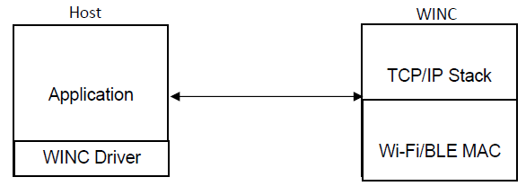

# Supported Network Modes in WINC

WINC devices can work in two modes.

-   Socket mode

-   Bypass mode.

**Parent topic:**[Harmony 3 Wireless application examples for WINC1500](GUID-D41DC58E-4197-40C3-B2E5-298EE2491305.md)

## Socket Mode

By default, WINC firmware includes TCP/ IP Stack, and Wifi/ BT MAC. Socket Mode exports driver level APIs for the User to write his Application and configure / communicate the TCP/ IP Stack and the Wi-Fi Stack using these APIs.

## Bypass Mode

In Bypass mode, instead of using TCP/IP stack of WINC firmware, user can use Harmony 3 TCP/IP stack on host side and directly access mac layer of WINC firmware via the WINC Driver APIs. In this case TCP/IP stack of WINC firmware is bypassed.

