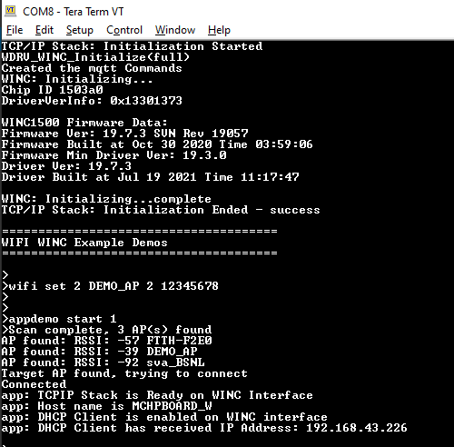

# Iperf Demo

This application demonstrates how a user can run iperf application on WINC1500 device in Bypass mode.

1.  Configure the wifi parameters using "wifi set" command.

    

2.  Enter the command "appdemo start 1" to set the DUT\(Device Under Test\) in station mode. It will connect to the wifi network and the IP address will be displayed on the terminal.

    

3.  The user should enter the iperf commands in the terminal window \(for DUT\) and in the iperf application which is available in the PC.

    |Protocol|PC|DUT|Command on PC|Command on DUT|
    |--------|--|---|-------------|--------------|
    |UDP|Client|Server|iperf -u -c <Server\_IP\_Address\> -t <time\_peroid\> -i <time\_interval\> -u -b <bandwidth\>, e.g.: iperf -u -c 192.168.43.27 -b 20M -i 1 -t 10|iperf -s -u -i <time\_interval\>, e.g.: iperf -s -u -i 1|
    |UDP|Server|Client|iperf -s -u -i <time\_interval\>, e.g.: iperf -s -u -i 1|iperf -u -c <Server\_IP\_Address\> -t <time\_peroid\> -i <time\_interval\> -u -b <bandwidth\>, e.g.: iperf -u -c 192.168.43.87 -b 20M -i 1 -t 10|
    |TCP|Client|Server|iperf -c <Server\_IP\_Address\> -t <time\_peroid\> -i <time\_interval\> e.g: iperf -c 192.168.43.27 -i 1 -t 10|iperf -s -i <time\_interval\>, e.g: iperf -s -i 1|
    |TCP|Server|Client|iperf -s -i <time\_interval\>, e.g: iperf -s -i 1|iperf -c <Server\_IP\_Address\> -t <time\_peroid\> -x <bandwidth\>, e.g: iperf -c 192.168.43.87 -x 10M -t 10|
    | |

**Parent topic:**[WINC1500 Bypass Mode Demo Applications](GUID-40C3ABB9-0449-4A53-94DF-0DFB4CE5540E.md)

