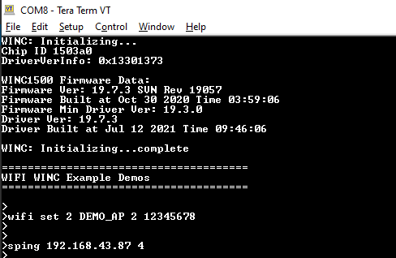
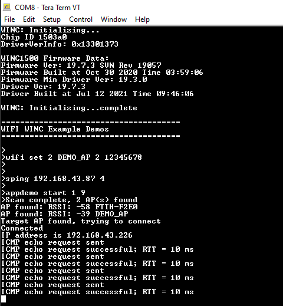

# Ping Demo

This application demonstrates how a user can run a ping test on WINC1500 device.

1.  Configure the wifi parameters using "wifi set" command.

    

2.  Enter the command "sping <ip\_address\> <no\_of\_ping\>".

    

3.  Then enter the command "appdemo start 1 9" to run the Ping demo. First the device will connect to the network. After the IP address has displayed on the terminal window, the ping command will start.

    

**Parent topic:**[WINC1500 Socket Mode Demo Applications](GUID-52D24502-1FE3-473D-9DA1-624A4E26166B.md)

