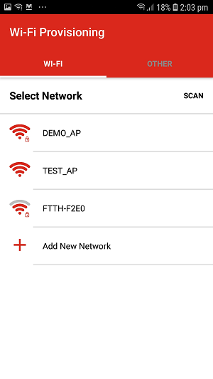

# WiFi Provisioning

The WiFi Provisioning application is used for receiving Wi-Fi provisioning data via the microchip android application "WiFi-Provisioning" and then triggering a Wi-Fi connection.

1.  Download the android application "WiFi Provisioning" of Microchip Technologies from App store.

2.  Start the DUT as Access Point. Use "wifi set" command to configure Access Point. In the configuration, set the bootmode as Access point mode, keep the authentication type as "OPEN" and give an SSID name for the Access point.

    

3.  Enter the command "appdemo start 1" to run the application.

    

4.  Connect the mobile phone to this Access point. The IP address of connected device will be displayed on the console.

    

5.  Open the WiFi Provisioning application in mobile phone. Set the Server IP Address as "192.168.1.1" and Server Port Number as **"80"**. Then press connect.

    

6.  The list of available networks will be displayed in the next window.

    

7.  Select the network and enter the password. Then press, "SEND".

    

8.  The DUT will connect to the selected network and the IP address will be displayed on the terminal.

    

[Back to top](#top)

**Parent topic:**[WINC1500 Socket Mode Demo Applications](GUID-52D24502-1FE3-473D-9DA1-624A4E26166B.md)

