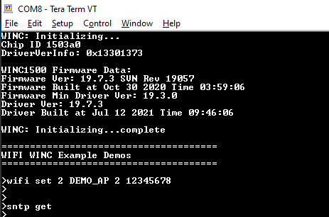
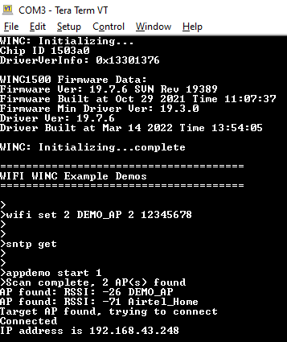
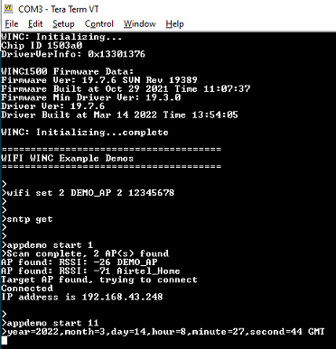

# SNTP Demo

This example demonstrates the use of the WINC1500 to retrieve time information from the time server. Follow the below mentioned steps to run the demo.

1.  Configure the wifi parameters using "wifi set" command.

    

2.  Enter the command "sntp get".

    

3.  Enter the command "appdemo start 1". First the device will connect to the network and the IP address will be displayed on the terminal window.

    

4.  Enter the command "appdemo start 11", application will execute the SNTP command and the response will be displayed on the terminal window.

    

**Parent topic:**[WINC1500 Socket Mode Demo Applications](GUID-52D24502-1FE3-473D-9DA1-624A4E26166B.md)

